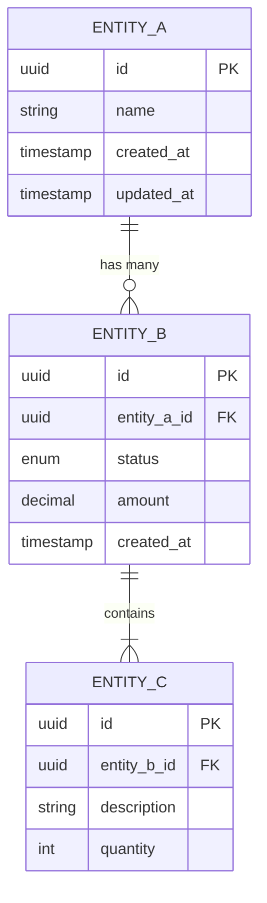
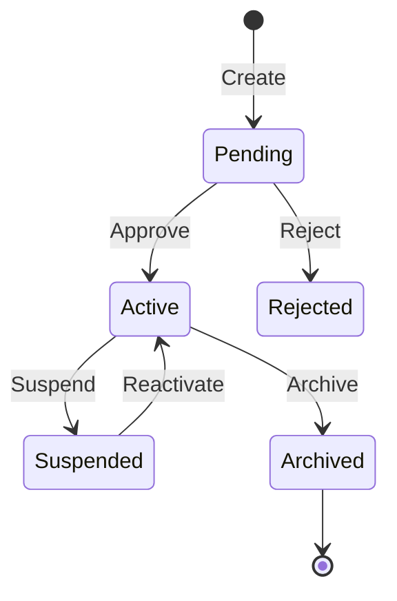

# Domain Spec Template

Use this template when creating domain specifications.

**IMPORTANT:** All domain specs MUST include an Entity Relationship Diagram (ERD).

---

```markdown
# [Domain Name] Domain

> **Version:** 1.0.0
> **Status:** Draft | Review | Approved
> **Last Updated:** YYMMDD

---

## 1. Overview

[2-3 sentences describing this domain's purpose and scope]

### Responsibilities
- [What this domain owns]
- [What decisions it makes]
- [What data it manages]

### Boundaries
- [What this domain does NOT handle]
- [What belongs to other domains]

---

## 2. Entity Relationship Diagram (REQUIRED)



---

## 3. Entities

### [Entity A]

| Field | Type | Constraints | Description |
|-------|------|-------------|-------------|
| id | UUID | PK | Unique identifier |
| name | VARCHAR(255) | NOT NULL | Display name |
| status | ENUM | NOT NULL | active, inactive, archived |
| created_at | TIMESTAMP | NOT NULL | Creation time |
| updated_at | TIMESTAMP | NOT NULL | Last update time |

**Business Rules:**
- [Rule 1]
- [Rule 2]

### [Entity B]

| Field | Type | Constraints | Description |
|-------|------|-------------|-------------|
| id | UUID | PK | Unique identifier |
| entity_a_id | UUID | FK, NOT NULL | Reference to Entity A |
| amount | DECIMAL(10,2) | NOT NULL | Monetary amount |

**Business Rules:**
- [Rule 1]
- [Rule 2]

---

## 4. State Machine

### [Entity] Lifecycle



| Transition | From | To | Trigger | Validation |
|------------|------|-----|---------|------------|
| create | - | Pending | User action | [rules] |
| approve | Pending | Active | Admin approval | [rules] |
| reject | Pending | Rejected | Admin decision | [rules] |

---

## 5. Domain Events

| Event | Trigger | Payload | Consumers |
|-------|---------|---------|-----------|
| [entity].created | New entity added | { id, ...fields } | [Other domains] |
| [entity].updated | Entity modified | { id, changes } | [Other domains] |
| [entity].deleted | Entity removed | { id } | [Other domains] |

---

## 6. API Contracts

### Public Endpoints

#### GET /api/v1/[domain]/[resource]

**Query Parameters:**
| Param | Type | Required | Description |
|-------|------|----------|-------------|
| page | int | No | Page number (default: 1) |
| limit | int | No | Items per page (default: 20) |
| status | string | No | Filter by status |

**Response (200):**
```json
{
  "data": [...],
  "pagination": {
    "page": 1,
    "limit": 20,
    "total": 100
  }
}
```

#### POST /api/v1/[domain]/[resource]

**Request:**
```json
{
  "field": "value"
}
```

**Response (201):**
```json
{
  "id": "uuid",
  "field": "value",
  "created_at": "timestamp"
}
```

---

## 7. Business Rules & Constraints

### Validation Rules

| Rule | Description | Error Code |
|------|-------------|------------|
| [RULE-001] | [Description] | [ERROR_CODE] |
| [RULE-002] | [Description] | [ERROR_CODE] |

### Constraints

| Constraint | Type | Description |
|------------|------|-------------|
| [Name] | Unique | [Description] |
| [Name] | Foreign Key | [Description] |
| [Name] | Check | [Description] |

---

## 8. Error Codes

| Code | Name | Description | Resolution |
|------|------|-------------|------------|
| [DOMAIN]_001 | [ErrorName] | [When this occurs] | [How to fix] |
| [DOMAIN]_002 | [ErrorName] | [When this occurs] | [How to fix] |

---

## 9. Dependencies

### Depends On
- [Domain A] — [Why/What data]
- [Domain B] — [Why/What data]

### Depended By
- [Domain C] — [Why/What data]
- [Domain D] — [Why/What data]

### External Services
- [Service Name] — [Purpose]

---

## 10. Open Questions

| # | Question | Impact | Status |
|---|----------|--------|--------|
| 1 | [Unresolved question] | [How it affects domain] | Open |

---

## 11. Related Features

- [YYMMDD-feature-name](../03-features/YYMMDD-feature-name/spec.md)

---

## 12. Changelog

### YYMMDD - v1.0.0 - Initial Draft
- Created domain spec
- Defined entities and relationships
- Added ERD diagram
```

---

## ERD Requirements

The ERD MUST show:
- All entities in the domain
- Primary keys (PK)
- Foreign keys (FK)
- Relationships with cardinality:
  - `||--||` one-to-one
  - `||--o{` one-to-many
  - `}o--o{` many-to-many
- Key fields with types

---

## Validation Rules

Before finalizing any domain spec, verify:

- [ ] Version header present
- [ ] ERD mermaid diagram included
- [ ] All entities documented with field types
- [ ] State machine for stateful entities
- [ ] Business rules listed
- [ ] API contracts defined
- [ ] Dependencies mapped (incoming and outgoing)
- [ ] Domain events documented
- [ ] Error codes defined
- [ ] Open questions listed
- [ ] Changelog has initial entry
