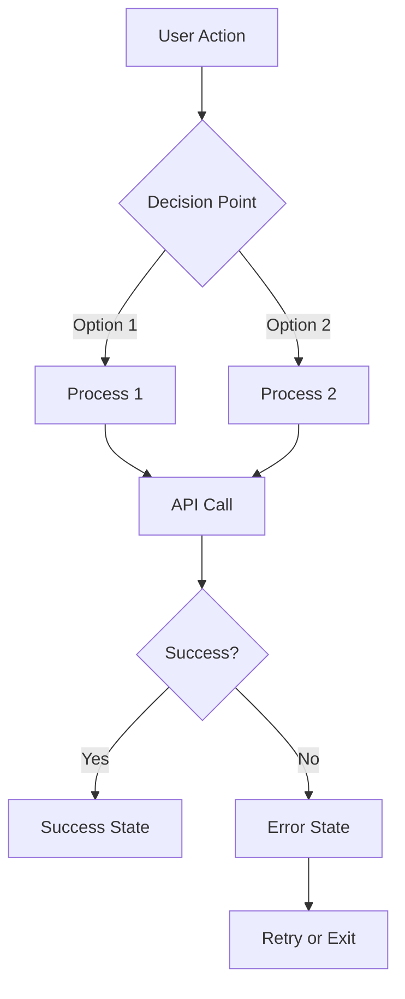
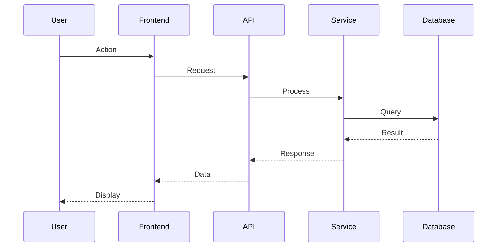

# Feature Spec Template

Use this template when creating new feature specifications.

**IMPORTANT:** All features MUST include a mermaid user flow diagram.

---

```markdown
# [Feature Name]

> **Version:** 1.0.0
> **Status:** Draft | Review | Approved
> **Feature ID:** YYMMDD-feature-name
> **Domain:** [Link to domain spec]
> **Created:** YYMMDD
> **Last Updated:** YYMMDD

---

## 1. Overview

[2-3 sentences describing what this feature does]

### Business Value
- [Why this feature matters]
- [What problem it solves]
- [Who benefits]

---

## 2. User Flow Diagram (REQUIRED)



**Flow Description:**
1. [Step 1 description]
2. [Step 2 description]
3. [Step 3 description]

---

## 3. Requirements

### 3.1 Functional Requirements (MUST)

| ID | Requirement | Priority |
|----|-------------|----------|
| FR-001 | [Requirement description] | High |
| FR-002 | [Requirement description] | Medium |

### 3.2 Non-Functional Requirements (SHOULD)

| ID | Requirement | Target |
|----|-------------|--------|
| NFR-001 | Performance | [e.g., < 200ms response] |
| NFR-002 | Availability | [e.g., 99.9% uptime] |

### 3.3 Out of Scope

- [Explicitly state what this feature does NOT include]
- [Prevents scope creep]

---

## 4. Technical Design

### Architecture

[Describe how this feature fits into the system]

### Data Flow Diagram



### Key Files
- `path/to/file.ts` — [Purpose]
- `path/to/component.tsx` — [Purpose]

### Dependencies
- [Internal: other features/domains this depends on]
- [External: third-party services/libraries]

---

## 5. UI/UX

### Wireframe

```
┌─────────────────────────────────────────┐
│  Header / Navigation                     │
├─────────────────────────────────────────┤
│                                          │
│  ┌─────────────────────────────────┐    │
│  │  Main Content Area               │    │
│  │                                  │    │
│  │  [Form/List/Dashboard]           │    │
│  │                                  │    │
│  └─────────────────────────────────┘    │
│                                          │
│  [Primary Action Button]                 │
│                                          │
└─────────────────────────────────────────┘
```

### States
- **Loading:** [Description]
- **Empty:** [Description]
- **Error:** [Description]
- **Success:** [Description]

---

## 6. API Contract

### Endpoints

#### POST /api/v1/[resource]

**Request:**
```json
{
  "field": "type"
}
```

**Response (200):**
```json
{
  "id": "string",
  "created": "timestamp"
}
```

**Errors:**
| Code | Message | When |
|------|---------|------|
| 400 | Invalid input | [condition] |
| 401 | Unauthorized | [condition] |
| 404 | Not found | [condition] |

---

## 7. Acceptance Criteria

| ID | Criteria | Testable? |
|----|----------|-----------|
| AC-001 | Given [context], when [action], then [result] | Yes |
| AC-002 | Given [context], when [action], then [result] | Yes |

---

## 8. Testing

### Unit Tests
- [ ] [Component/function to test]

### Integration Tests
- [ ] [API endpoint to test]

### E2E Tests
- [ ] [User flow to test]

---

## 9. Open Questions

| # | Question | Impact | Status |
|---|----------|--------|--------|
| 1 | [Unresolved question] | [How it affects implementation] | Open |
| 2 | [Unresolved question] | [How it affects implementation] | Resolved |

---

## 10. Blockers

| Blocker | Status | Owner |
|---------|--------|-------|
| [Description] | Open/Resolved | [Name] |

---

## 11. Implementation Progress

| Task | Status | Notes |
|------|--------|-------|
| [Task 1] | Done/In Progress/Pending | |
| [Task 2] | Done/In Progress/Pending | |

---

## 12. Changelog

### YYMMDD - v1.0.0 - Initial Draft
- Created spec
- Defined requirements
- Added user flow diagram

### YYMMDD - v1.1.0 - [Update Title]
- [What changed]
- Reason: [Why]
```

---

## Diagram Requirements

| Diagram Type | When Required | Purpose |
|--------------|---------------|---------|
| User Flow (flowchart) | ALWAYS | Shows user journey through feature |
| Data Flow (sequence) | Complex features | Shows component interactions |
| State Machine | Stateful features | Shows state transitions |

---

## Validation Rules

Before finalizing any feature spec, verify:

- [ ] Version header present (v1.0.0 format)
- [ ] Status field present (Draft/Review/Approved)
- [ ] User flow mermaid diagram included
- [ ] All FRs have priority
- [ ] All NFRs have measurable targets
- [ ] API contracts have request/response examples
- [ ] Acceptance criteria are testable (Given/When/Then)
- [ ] Open questions listed
- [ ] Changelog has initial entry
