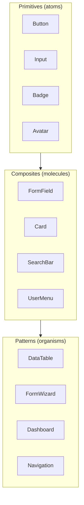

# Component Library Template

Use this template for `03-design/component-library.md`.

---

```markdown
# Component Library

> **Version:** 1.0.0
> **Status:** Draft | Review | Approved
> **Last Updated:** YYMMDD

---

## 1. Overview

This document catalogs all reusable UI components with usage guidelines.

---

## 2. Component Hierarchy



---

## 3. Primitives

### Button

**Variants:** Primary, Secondary, Outline, Ghost, Destructive
**Sizes:** sm, md, lg

```tsx
interface ButtonProps {
  variant?: 'primary' | 'secondary' | 'outline' | 'ghost' | 'destructive';
  size?: 'sm' | 'md' | 'lg';
  disabled?: boolean;
  loading?: boolean;
  leftIcon?: ReactNode;
  rightIcon?: ReactNode;
  children: ReactNode;
  onClick?: () => void;
}

// Usage
<Button variant="primary" size="md">
  Save Changes
</Button>

<Button variant="destructive" leftIcon={<Trash />}>
  Delete
</Button>
```

---

### Input

**Types:** Text, Email, Password, Number, Search, Textarea

```tsx
interface InputProps {
  type?: 'text' | 'email' | 'password' | 'number' | 'search';
  label?: string;
  placeholder?: string;
  error?: string;
  helpText?: string;
  disabled?: boolean;
  required?: boolean;
}

// Usage
<Input
  label="Email"
  type="email"
  placeholder="you@example.com"
  error="Invalid email format"
  required
/>
```

---

### Badge

**Variants:** Default, Success, Warning, Error, Info

```tsx
interface BadgeProps {
  variant?: 'default' | 'success' | 'warning' | 'error' | 'info';
  size?: 'sm' | 'md';
  dot?: boolean;
  children: ReactNode;
}

// Usage
<Badge variant="success">Active</Badge>
<Badge variant="warning" dot>Pending Review</Badge>
```

---

### Avatar

**Sizes:** xs, sm, md, lg, xl

```tsx
interface AvatarProps {
  src?: string;
  alt?: string;
  fallback?: string;
  size?: 'xs' | 'sm' | 'md' | 'lg' | 'xl';
}

// Usage
<Avatar
  src="/avatars/user.jpg"
  alt="John Doe"
  fallback="JD"
  size="md"
/>
```

---

## 4. Composites

### FormField

Combines label, input, help text, and error message.

```tsx
interface FormFieldProps {
  label: string;
  name: string;
  type?: InputType;
  error?: string;
  helpText?: string;
  required?: boolean;
}

// Usage
<FormField
  label="Username"
  name="username"
  helpText="This will be your public display name"
  required
/>
```

---

### Card

Container for content with optional header and footer.

```tsx
interface CardProps {
  title?: string;
  description?: string;
  actions?: ReactNode;
  children: ReactNode;
}

// Usage
<Card
  title="User Profile"
  description="Manage your account settings"
  actions={<Button>Edit</Button>}
>
  <UserDetails />
</Card>
```

---

### SearchBar

Search input with filters and clear button.

```tsx
interface SearchBarProps {
  placeholder?: string;
  value: string;
  onChange: (value: string) => void;
  filters?: Filter[];
  onFilter?: (filters: Filter[]) => void;
}

// Usage
<SearchBar
  placeholder="Search users..."
  value={search}
  onChange={setSearch}
  filters={[
    { key: 'status', options: ['active', 'inactive'] },
    { key: 'role', options: ['admin', 'user'] }
  ]}
/>
```

---

## 5. Patterns

### DataTable

Sortable, filterable table with pagination.

```tsx
interface DataTableProps<T> {
  data: T[];
  columns: Column<T>[];
  sortable?: boolean;
  selectable?: boolean;
  pagination?: PaginationConfig;
  onRowClick?: (row: T) => void;
  emptyState?: ReactNode;
}

// Usage
<DataTable
  data={users}
  columns={[
    { key: 'name', label: 'Name', sortable: true },
    { key: 'email', label: 'Email' },
    { key: 'status', label: 'Status', render: StatusBadge },
    { key: 'actions', label: '', render: ActionMenu }
  ]}
  pagination={{ page: 1, pageSize: 20, total: 100 }}
  selectable
/>
```

---

### Modal / Dialog

Overlay for focused interactions.

```tsx
interface ModalProps {
  open: boolean;
  onClose: () => void;
  title: string;
  description?: string;
  size?: 'sm' | 'md' | 'lg' | 'xl';
  children: ReactNode;
  footer?: ReactNode;
}

// Usage
<Modal
  open={isOpen}
  onClose={() => setIsOpen(false)}
  title="Delete User"
  description="Are you sure? This action cannot be undone."
  footer={
    <>
      <Button variant="outline" onClick={onClose}>Cancel</Button>
      <Button variant="destructive" onClick={onDelete}>Delete</Button>
    </>
  }
/>
```

---

### Toast / Notification

Temporary feedback messages.

```tsx
interface ToastProps {
  variant: 'success' | 'error' | 'warning' | 'info';
  title: string;
  description?: string;
  action?: { label: string; onClick: () => void };
  duration?: number;
}

// Usage (via hook)
const { toast } = useToast();

toast({
  variant: 'success',
  title: 'User created',
  description: 'The user has been added successfully.',
});
```

---

### Empty State

Placeholder when no data exists.

```tsx
interface EmptyStateProps {
  icon?: ReactNode;
  title: string;
  description?: string;
  action?: { label: string; onClick: () => void };
}

// Usage
<EmptyState
  icon={<Users />}
  title="No users found"
  description="Get started by adding your first user."
  action={{ label: 'Add User', onClick: handleAdd }}
/>
```

---

## 6. Layout Components

### PageHeader

Standard page header with title and actions.

```tsx
<PageHeader
  title="Users"
  description="Manage your team members"
  breadcrumbs={[
    { label: 'Dashboard', href: '/' },
    { label: 'Users' }
  ]}
  actions={
    <Button leftIcon={<Plus />}>Add User</Button>
  }
/>
```

---

### Sidebar

Navigation sidebar with collapsible sections.

```tsx
<Sidebar
  logo={<Logo />}
  items={[
    { icon: <Home />, label: 'Dashboard', href: '/' },
    { icon: <Users />, label: 'Users', href: '/users' },
    {
      icon: <Settings />,
      label: 'Settings',
      children: [
        { label: 'General', href: '/settings' },
        { label: 'Security', href: '/settings/security' }
      ]
    }
  ]}
  footer={<UserMenu />}
/>
```

---

## 7. Form Patterns

### Standard Form Layout

```tsx
<Form onSubmit={handleSubmit}>
  <FormField label="Name" name="name" required />
  <FormField label="Email" name="email" type="email" required />
  <FormField label="Role" name="role" type="select" options={roles} />

  <FormActions>
    <Button variant="outline" type="reset">Cancel</Button>
    <Button type="submit">Save</Button>
  </FormActions>
</Form>
```

---

## 8. Component Status

| Component | Status | Tests | A11y |
|-----------|--------|-------|------|
| Button | ✅ Ready | ✅ | ✅ |
| Input | ✅ Ready | ✅ | ✅ |
| Badge | ✅ Ready | ✅ | ✅ |
| Avatar | ✅ Ready | ✅ | ✅ |
| Card | ✅ Ready | ✅ | ✅ |
| Modal | ✅ Ready | ✅ | ✅ |
| DataTable | ✅ Ready | ✅ | ⚠️ |
| Toast | ✅ Ready | ✅ | ✅ |
| Sidebar | ✅ Ready | ⚠️ | ✅ |

---

## 9. Open Questions

| # | Question | Impact | Status |
|---|----------|--------|--------|
| 1 | [Component decision] | [Impact] | Open |

---

## 10. Changelog

### YYMMDD - v1.0.0 - Initial Draft
- Documented core primitives
- Added composite components
- Established pattern library
```

---

## Validation Rules

- [ ] Version header present
- [ ] Component hierarchy documented
- [ ] Props interfaces defined
- [ ] Usage examples provided
- [ ] Component status tracked
