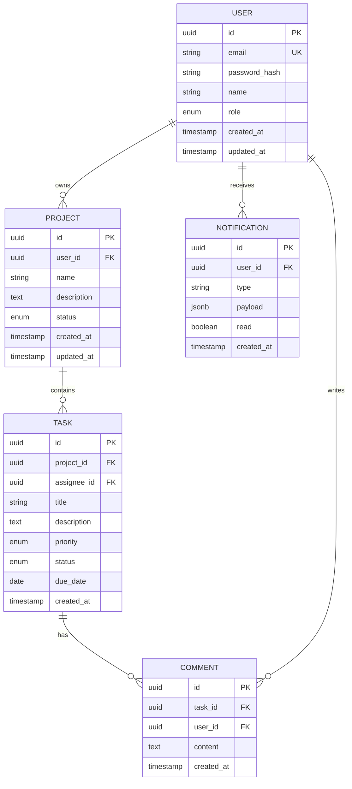
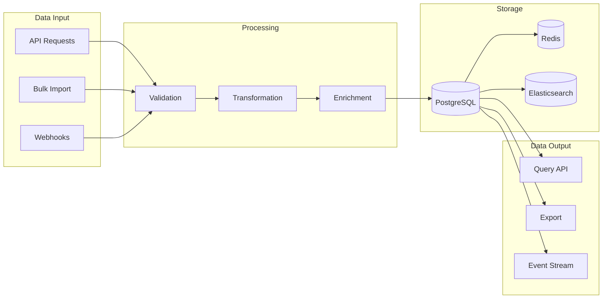

# Data Architecture Template

**REQUIRED:** Entity Relationship Diagram (ERD)

---

```markdown
# Data Architecture

> **Version:** 1.0.0
> **Status:** Draft | Review | Approved
> **Last Updated:** YYMMDD

---

## 1. Overview

[2-3 sentences describing the data architecture approach and philosophy]

---

## 2. Entity Relationship Diagram (REQUIRED)



---

## 3. Database Strategy

### Primary Database
| Attribute | Value |
|-----------|-------|
| Engine | [PostgreSQL 15 / MySQL 8 / etc.] |
| Hosting | [RDS / Cloud SQL / Self-hosted] |
| Replication | [Read replicas / Multi-AZ] |
| Backup | [Daily snapshots, 30-day retention] |

### Secondary Stores
| Store | Purpose | Data Types |
|-------|---------|------------|
| Redis | Cache, sessions | Hot data, user sessions |
| Elasticsearch | Search | Product catalog, logs |
| S3 | Files | User uploads, backups |

---

## 4. Entity Catalog

### Core Entities

#### USER
| Field | Type | Constraints | Description |
|-------|------|-------------|-------------|
| id | UUID | PK | Unique identifier |
| email | VARCHAR(255) | UK, NOT NULL | User email |
| password_hash | VARCHAR(255) | NOT NULL | Bcrypt/Argon2 hash |
| name | VARCHAR(100) | NOT NULL | Display name |
| role | ENUM | NOT NULL | admin, user, guest |
| created_at | TIMESTAMP | NOT NULL | Creation time |
| updated_at | TIMESTAMP | NOT NULL | Last update |

**Indexes:**
- `idx_user_email` (email) - Login lookup
- `idx_user_role` (role) - Role filtering

**Business Rules:**
- Email must be unique and valid format
- Password must be hashed before storage
- Role defaults to 'user' on creation

#### PROJECT
| Field | Type | Constraints | Description |
|-------|------|-------------|-------------|
| id | UUID | PK | Unique identifier |
| user_id | UUID | FK, NOT NULL | Owner reference |
| name | VARCHAR(255) | NOT NULL | Project name |
| description | TEXT | | Project description |
| status | ENUM | NOT NULL | active, archived, deleted |
| created_at | TIMESTAMP | NOT NULL | Creation time |
| updated_at | TIMESTAMP | NOT NULL | Last update |

**Indexes:**
- `idx_project_user` (user_id) - User's projects
- `idx_project_status` (status) - Status filtering

---

## 5. Data Flow



---

## 6. Data Lifecycle

| State | Duration | Storage | Action |
|-------|----------|---------|--------|
| Active | Indefinite | Primary DB | Full access |
| Archived | 1 year | Primary DB | Read-only |
| Soft Deleted | 30 days | Primary DB | Hidden, recoverable |
| Hard Deleted | 0 | None | Permanently removed |

### Retention Policies
| Data Type | Retention | Reason |
|-----------|-----------|--------|
| User data | 7 years | Legal compliance |
| Logs | 90 days | Debugging |
| Sessions | 7 days | Security |
| Analytics | 2 years | Business insights |

---

## 7. Migrations Strategy

### Approach
- Tool: [Prisma Migrate / Flyway / Alembic]
- Versioning: Sequential timestamps (YYYYMMDDHHMMSS)
- Rollback: Required for all migrations

### Migration Checklist
- [ ] Backward compatible (no breaking changes)
- [ ] Tested on staging data
- [ ] Rollback script prepared
- [ ] Estimated execution time documented
- [ ] Notify team before production run

---

## 8. Rules & Constraints

### Naming Conventions
| Type | Convention | Example |
|------|------------|---------|
| Tables | snake_case, plural | `users`, `order_items` |
| Columns | snake_case | `created_at`, `user_id` |
| Indexes | idx_table_column | `idx_user_email` |
| Foreign Keys | fk_table_ref | `fk_order_user` |

### Data Integrity
- All tables have `id` as UUID primary key
- All tables have `created_at` and `updated_at`
- Soft delete via `deleted_at` column where applicable
- Foreign keys enforced at database level

---

## 9. Dependencies

### Internal
- Auth domain: User management
- All domains: Notification preferences

### External
- [Cloud storage]: File uploads
- [Analytics service]: Event tracking

---

## 10. Open Questions

| # | Question | Impact | Status |
|---|----------|--------|--------|
| 1 | [Question] | [Impact] | Open |

---

## 11. Changelog

### YYMMDD - v1.0.0 - Initial Draft
- Created data architecture spec
- Defined ERD with core entities
- Documented storage strategy
```

---

## ERD Requirements

The ERD MUST show:
- All core entities
- Primary keys (PK)
- Foreign keys (FK)
- Unique constraints (UK)
- Key field types
- Relationship cardinality
