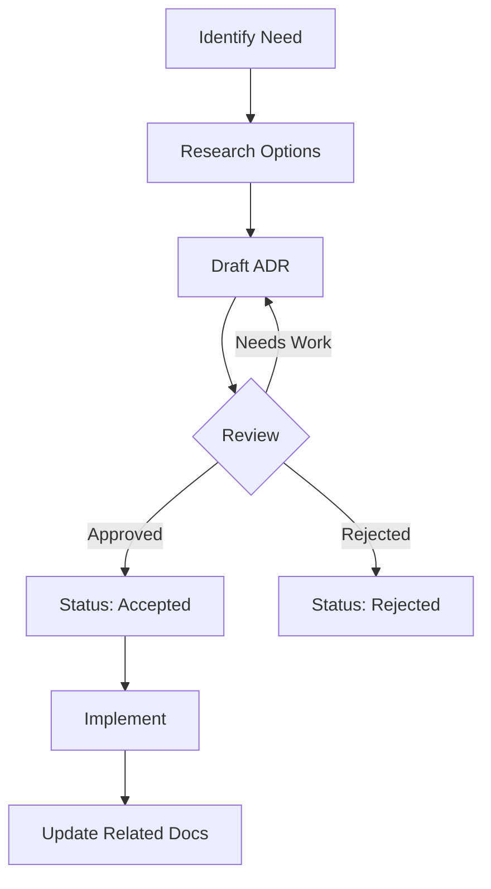

# Decision Log Template

Use this template for `04-governance/decision-log.md`.

---

```markdown
# Decision Log (ADRs)

> **Version:** 1.0.0
> **Status:** Active
> **Last Updated:** YYMMDD

---

## 1. Overview

This document tracks all Architecture Decision Records (ADRs) for the project.

---

## 2. Decision Index

| ID | Title | Status | Date | Impact |
|----|-------|--------|------|--------|
| ADR-001 | [Decision title] | Accepted | YYMMDD | High |
| ADR-002 | [Decision title] | Accepted | YYMMDD | Medium |
| ADR-003 | [Decision title] | Proposed | YYMMDD | High |
| ADR-004 | [Decision title] | Superseded | YYMMDD | Low |

**Status Legend:**
- **Proposed** — Under discussion
- **Accepted** — Approved and in effect
- **Deprecated** — No longer recommended
- **Superseded** — Replaced by another ADR

---

## 3. Decision Records

### ADR-001: [Decision Title]

**Date:** YYMMDD
**Status:** Accepted
**Deciders:** [Names/Roles]

#### Context

[What is the issue that we're seeing that motivates this decision?]

#### Decision

**We will [decision statement].**

[More detail on what exactly was decided]

#### Options Considered

| Option | Pros | Cons |
|--------|------|------|
| Option A | [+] [+] | [-] [-] |
| Option B (Chosen) | [+] [+] | [-] [-] |
| Option C | [+] [+] | [-] [-] |

#### Consequences

**Positive:**
- [Benefit 1]
- [Benefit 2]

**Negative:**
- [Tradeoff 1]
- [Tradeoff 2]

**Risks:**
- [Risk 1] — Mitigation: [approach]

#### Related

- Links to related ADRs
- Links to relevant documentation

---

### ADR-002: [Decision Title]

**Date:** YYMMDD
**Status:** Accepted
**Deciders:** [Names/Roles]

#### Context

[Context and motivation]

#### Decision

**We will [decision].**

#### Options Considered

| Option | Pros | Cons |
|--------|------|------|
| [Option] | [+] | [-] |

#### Consequences

[Positive and negative consequences]

---

## 4. Decision Templates

### For Major Decisions (High Impact)

Use full ADR format with:
- Detailed context
- All options evaluated
- Formal consequences analysis
- Risk mitigation plans

### For Minor Decisions (Low Impact)

Use abbreviated format:
```
**Decision:** [What]
**Reason:** [Why]
**Date:** [When]
```

---

## 5. Decision Making Process



### When to Create an ADR

- Major technology choices
- Architectural patterns
- Breaking changes
- Security decisions
- Significant tradeoffs
- Reversible decisions with high stakes

### When NOT to Create an ADR

- Bug fixes
- Minor refactoring
- Obvious choices
- Temporary solutions

---

## 6. Sample ADRs

### ADR-XXX: Use PostgreSQL as Primary Database

**Date:** YYMMDD
**Status:** Accepted

#### Context

We need a database for our application. We expect:
- Relational data with complex queries
- ACID compliance for transactions
- Scale to millions of records
- JSON support for flexible fields

#### Decision

**We will use PostgreSQL 16 as our primary database.**

#### Options Considered

| Option | Pros | Cons |
|--------|------|------|
| PostgreSQL | ACID, JSON, mature, free | Self-managed complexity |
| MySQL | Simple, widespread | Weaker JSON, strict SQL |
| MongoDB | Flexible schema, scale | No joins, eventual consistency |

#### Consequences

**Positive:**
- Strong data integrity
- Excellent JSON support with JSONB
- Rich ecosystem (PostGIS, pg_vector)
- Cost-effective

**Negative:**
- Need expertise for optimization
- Scaling requires planning

---

### ADR-XXX: Adopt TypeScript Strict Mode

**Date:** YYMMDD
**Status:** Accepted

#### Context

Our JavaScript codebase has runtime errors that could be caught at compile time.

#### Decision

**We will enable TypeScript strict mode on all projects.**

```json
{
  "compilerOptions": {
    "strict": true,
    "noImplicitAny": true,
    "strictNullChecks": true
  }
}
```

#### Consequences

**Positive:**
- Catch errors at compile time
- Better IDE support
- Safer refactoring

**Negative:**
- Migration effort for existing code
- Steeper learning curve

---

## 7. Superseded Decisions

### ADR-XXX: [Old Decision] (Superseded by ADR-YYY)

**Date:** YYMMDD
**Status:** Superseded
**Superseded by:** ADR-YYY

[Keep for historical context, link to new decision]

---

## 8. Open Questions

| # | Question | Impact | Status |
|---|----------|--------|--------|
| 1 | [Pending decision] | [Impact] | Open |

---

## 9. Changelog

### YYMMDD - v1.0.0 - Initial Draft
- Created decision log structure
- Added decision index
- Established ADR template
```

---

## Validation Rules

- [ ] Version header present
- [ ] Decision index maintained
- [ ] Each ADR has required sections
- [ ] Status clearly marked
- [ ] Superseded decisions linked
