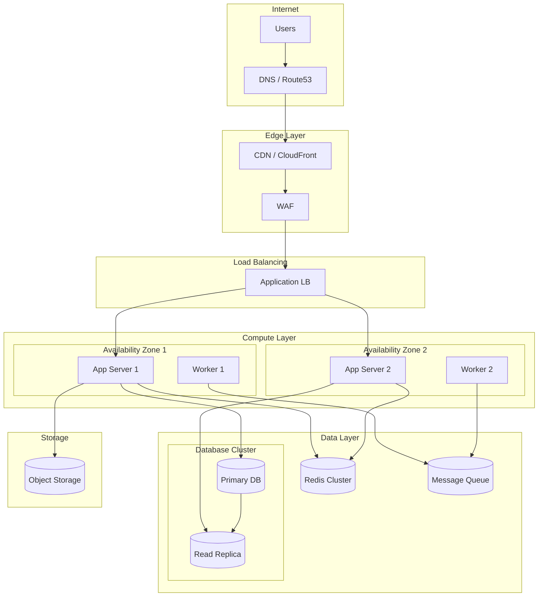
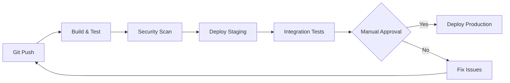

# Infrastructure Template

**REQUIRED:** Deployment topology diagram

---

```markdown
# Infrastructure

> **Version:** 1.0.0
> **Status:** Draft | Review | Approved
> **Last Updated:** YYMMDD

---

## 1. Overview

[2-3 sentences describing the infrastructure approach and cloud strategy]

---

## 2. Deployment Topology Diagram (REQUIRED)



---

## 3. Environments

| Environment | Purpose | URL | Access |
|-------------|---------|-----|--------|
| Development | Local dev | localhost:3000 | Developers |
| Staging | Pre-prod testing | staging.example.com | Team |
| Production | Live users | example.com | Public |

### Environment Configuration
| Setting | Dev | Staging | Prod |
|---------|-----|---------|------|
| App Instances | 1 | 2 | 4+ |
| DB Type | Local/Docker | RDS (db.t3.small) | RDS (db.r5.large) |
| Cache | Local Redis | ElastiCache (cache.t3.micro) | ElastiCache (cache.r5.large) |
| CDN | None | CloudFront | CloudFront |

---

## 4. Cloud Resources

### Compute
| Resource | Type | Specs | Purpose |
|----------|------|-------|---------|
| App Servers | EC2 / ECS | [t3.medium / 2vCPU, 4GB] | API and web serving |
| Workers | EC2 / Lambda | [t3.small / 1vCPU, 2GB] | Background jobs |

### Database
| Resource | Type | Specs | Purpose |
|----------|------|-------|---------|
| Primary DB | RDS PostgreSQL | [db.r5.large / Multi-AZ] | Main data store |
| Read Replica | RDS PostgreSQL | [db.r5.large] | Read scaling |
| Cache | ElastiCache Redis | [cache.r5.large / Cluster] | Session, caching |

### Storage
| Resource | Type | Purpose |
|----------|------|---------|
| S3 Bucket | Standard | User uploads, static assets |
| S3 Bucket | IA | Backups, archives |

### Networking
| Resource | Purpose |
|----------|---------|
| VPC | Network isolation |
| Public Subnets | Load balancers, NAT |
| Private Subnets | App servers, DB |
| Security Groups | Firewall rules |

---

## 5. Scaling Strategy

### Horizontal Scaling
| Component | Trigger | Min | Max |
|-----------|---------|-----|-----|
| App Servers | CPU > 70% | 2 | 10 |
| Workers | Queue depth > 1000 | 1 | 5 |

### Vertical Scaling
| Component | When to Scale Up |
|-----------|------------------|
| Database | IO wait > 20%, connections > 80% |
| Cache | Memory usage > 80% |

### Auto-scaling Configuration
```yaml
AutoScalingGroup:
  MinSize: 2
  MaxSize: 10
  DesiredCapacity: 2
  Cooldown: 300
  Metrics:
    - CPUUtilization
    - RequestCount
```

---

## 6. Deployment Process

### CI/CD Pipeline


### Deployment Strategy
| Environment | Strategy | Rollback |
|-------------|----------|----------|
| Staging | Rolling | Automatic |
| Production | Blue/Green | Manual trigger |

### Deployment Checklist
- [ ] All tests passing
- [ ] Security scan clean
- [ ] Database migrations ready
- [ ] Feature flags configured
- [ ] Monitoring alerts active
- [ ] Rollback plan documented

---

## 7. Disaster Recovery

### Backup Strategy
| Component | Frequency | Retention | Location |
|-----------|-----------|-----------|----------|
| Database | Daily | 30 days | Cross-region S3 |
| File Storage | Continuous | 90 days | Cross-region S3 |
| Configurations | On change | Forever | Git |

### Recovery Targets
| Metric | Target |
|--------|--------|
| RTO (Recovery Time Objective) | < 4 hours |
| RPO (Recovery Point Objective) | < 1 hour |

### Failover Process
1. Detect failure (automated monitoring)
2. Promote read replica to primary
3. Update DNS/Load balancer
4. Verify application health
5. Notify team

---

## 8. SLA Targets

| Metric | Target | Measurement |
|--------|--------|-------------|
| Availability | 99.9% | Monthly uptime |
| Response Time (p95) | < 500ms | API latency |
| Error Rate | < 0.1% | 5xx responses |

---

## 9. Cost Estimate

| Resource | Monthly Cost (Est.) |
|----------|---------------------|
| Compute | $[X] |
| Database | $[X] |
| Storage | $[X] |
| Network | $[X] |
| **Total** | **$[X]** |

---

## 10. Rules & Constraints

- All resources tagged with environment, project, owner
- No public DB access, use bastion/VPN
- Secrets in AWS Secrets Manager, never in code
- All traffic encrypted (TLS 1.2+)
- Logs retained for 90 days minimum

---

## 11. Open Questions

| # | Question | Impact | Status |
|---|----------|--------|--------|
| 1 | [Question] | [Impact] | Open |

---

## 12. Changelog

### YYMMDD - v1.0.0 - Initial Draft
- Created infrastructure spec
- Defined deployment topology
- Documented scaling strategy
```

---

## Diagram Requirements

The deployment topology MUST show:
- DNS/Edge layer (CDN, WAF)
- Load balancer layer
- Compute layer with availability zones
- Data layer (DB, cache, queue)
- Storage layer
- Network flow between components
