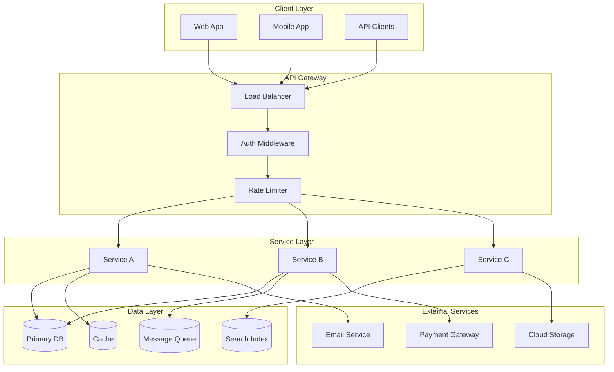
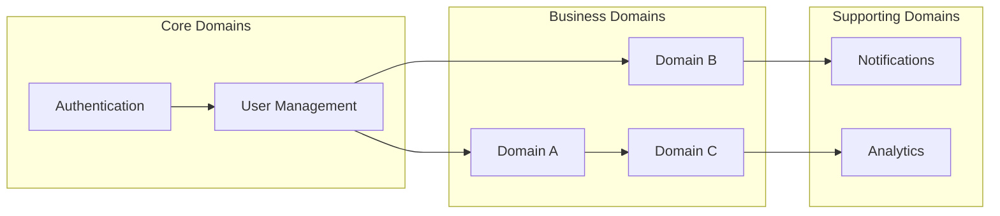

# Master Map Template

**REQUIRED:** System architecture diagram (mermaid)

---

```markdown
# System Master Map

> **Version:** 1.0.0
> **Status:** Draft | Review | Approved
> **Last Updated:** YYMMDD

---

## 1. Overview

[2-3 sentences describing the system's purpose and core value proposition]

---

## 2. System Architecture Diagram (REQUIRED)



---

## 3. Component Overview

### Client Layer
| Component | Technology | Purpose |
|-----------|------------|---------|
| Web App | [React/Vue/etc.] | [Main user interface] |
| Mobile App | [React Native/Flutter/etc.] | [Mobile experience] |
| API Clients | REST/GraphQL | [Third-party integrations] |

### Service Layer
| Service | Responsibility | Dependencies |
|---------|----------------|--------------|
| [Service A] | [What it does] | [DB, Cache] |
| [Service B] | [What it does] | [DB, Queue, Payment] |
| [Service C] | [What it does] | [Search, Storage] |

### Data Layer
| Store | Technology | Purpose |
|-------|------------|---------|
| Primary DB | [PostgreSQL/MySQL/etc.] | [Persistent data] |
| Cache | [Redis/Memcached] | [Session, hot data] |
| Queue | [RabbitMQ/SQS/etc.] | [Async processing] |
| Search | [Elasticsearch/Algolia] | [Full-text search] |

---

## 4. Communication Patterns

### Synchronous
| From | To | Protocol | Purpose |
|------|-----|----------|---------|
| Client | Gateway | HTTPS | User requests |
| Gateway | Services | HTTP/gRPC | Internal calls |

### Asynchronous
| Publisher | Event | Subscriber | Purpose |
|-----------|-------|------------|---------|
| [Service A] | [event.name] | [Service B] | [Why] |

---

## 5. Cross-Cutting Concerns

### Authentication & Authorization
- **Method:** [JWT/OAuth2/Session]
- **Provider:** [Internal/Auth0/Cognito]
- **RBAC:** [Roles defined]

### Observability
- **Logging:** [ELK/CloudWatch/etc.]
- **Metrics:** [Prometheus/Datadog/etc.]
- **Tracing:** [Jaeger/X-Ray/etc.]

### Security
- **TLS:** Required for all external traffic
- **Secrets:** [Vault/AWS Secrets Manager]
- **WAF:** [CloudFlare/AWS WAF]

---

## 6. Domain Map



| Domain | Type | Responsibility |
|--------|------|----------------|
| Authentication | Core | User identity, sessions |
| [Domain A] | Business | [Primary business logic] |
| Notifications | Supporting | Email, push, SMS |

---

## 7. Rules & Constraints

- [System-level rule 1]
- [System-level rule 2]
- [System-level constraint 1]

---

## 8. Dependencies

### External APIs
| Service | Purpose | Criticality |
|---------|---------|-------------|
| [Service] | [Why needed] | Critical/High/Low |

### Infrastructure
| Provider | Services Used |
|----------|---------------|
| [AWS/GCP/Azure] | [EC2, RDS, S3, etc.] |

---

## 9. Open Questions

| # | Question | Impact | Status |
|---|----------|--------|--------|
| 1 | [Question] | [Impact] | Open |

---

## 10. Changelog

### YYMMDD - v1.0.0 - Initial Draft
- Created system master map
- Defined architecture diagram
- Documented component relationships
```

---

## Diagram Requirements

The system architecture diagram MUST show:
- Client layer (web, mobile, API)
- Gateway/load balancer
- All major services
- Data stores (DB, cache, queue)
- External service integrations
- Communication flows
