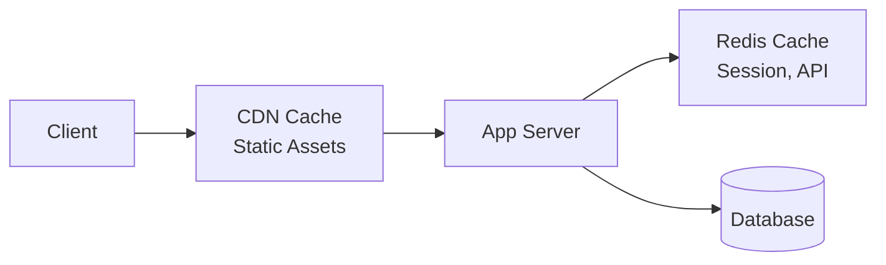

# Performance SLAs Template

Use this template for `02-standards/performance-slas.md`.

---

```markdown
# Performance SLAs

> **Version:** 1.0.0
> **Status:** Draft | Review | Approved
> **Last Updated:** YYMMDD

---

## 1. Overview

This document defines performance targets, SLAs, and monitoring requirements.

---

## 2. Response Time SLAs

### API Endpoints

| Category | p50 | p95 | p99 | Max |
|----------|-----|-----|-----|-----|
| Read (GET) | 50ms | 150ms | 300ms | 500ms |
| Write (POST/PUT) | 100ms | 300ms | 500ms | 1000ms |
| Search | 100ms | 500ms | 1000ms | 2000ms |
| Reports | 500ms | 2000ms | 5000ms | 10000ms |

### Frontend

| Metric | Target | Critical |
|--------|--------|----------|
| First Contentful Paint (FCP) | < 1.5s | < 2.5s |
| Largest Contentful Paint (LCP) | < 2.5s | < 4.0s |
| Time to Interactive (TTI) | < 3.0s | < 5.0s |
| Cumulative Layout Shift (CLS) | < 0.1 | < 0.25 |
| First Input Delay (FID) | < 100ms | < 300ms |

---

## 3. Availability SLAs

### Service Levels

| Environment | Availability | Downtime/Month |
|-------------|--------------|----------------|
| Production | 99.9% | < 43 min |
| Staging | 99.0% | < 7.3 hours |
| Development | 95.0% | < 36 hours |

### Maintenance Windows

- Scheduled: [Day] [Time] UTC (announced 48h ahead)
- Emergency: Any time (post-mortem within 24h)

---

## 4. Throughput Targets

### Concurrent Users

| Load Level | Users | Description |
|------------|-------|-------------|
| Normal | [N] | Typical daily load |
| Peak | [N x 2] | Peak hours |
| Stress | [N x 5] | Marketing events |
| Max | [N x 10] | System limit |

### Requests Per Second

| Endpoint | Normal | Peak | Max |
|----------|--------|------|-----|
| API total | 500 RPS | 1000 RPS | 2000 RPS |
| Auth endpoints | 100 RPS | 200 RPS | 500 RPS |
| Search | 50 RPS | 100 RPS | 200 RPS |

---

## 5. Database Performance

### Query Performance

| Query Type | Target | Max |
|------------|--------|-----|
| Simple SELECT | < 10ms | 50ms |
| JOIN (2-3 tables) | < 50ms | 200ms |
| Complex aggregation | < 200ms | 1000ms |
| Full-text search | < 100ms | 500ms |

### Connection Pool

| Setting | Value |
|---------|-------|
| Min connections | 5 |
| Max connections | 50 |
| Idle timeout | 30s |
| Connection timeout | 5s |

---

## 6. Caching Strategy

### Cache Tiers



### Cache TTLs

| Data Type | Cache | TTL |
|-----------|-------|-----|
| Static assets | CDN | 1 year |
| API responses | Redis | 5 min |
| User session | Redis | 24 hours |
| Config | Memory | 1 hour |
| Search results | Redis | 10 min |

### Cache Hit Rate Targets

| Cache | Target | Alert |
|-------|--------|-------|
| CDN | > 90% | < 80% |
| Redis | > 80% | < 70% |

---

## 7. Resource Limits

### Memory

| Component | Limit | Alert At |
|-----------|-------|----------|
| API Server | 1 GB | 80% |
| Worker | 2 GB | 80% |
| Database | 8 GB | 75% |
| Redis | 512 MB | 80% |

### CPU

| Component | Limit | Alert At |
|-----------|-------|----------|
| API Server | 2 cores | 70% |
| Worker | 4 cores | 80% |
| Database | 4 cores | 60% |

### Disk

| Component | Size | Alert At |
|-----------|------|----------|
| Database | 100 GB | 80% |
| Logs | 50 GB | 80% |
| Uploads | 500 GB | 85% |

---

## 8. Error Budgets

### Error Rate Targets

| Metric | Target | Alert | Critical |
|--------|--------|-------|----------|
| HTTP 5xx rate | < 0.1% | > 0.5% | > 1.0% |
| HTTP 4xx rate | < 2.0% | > 5.0% | > 10.0% |
| Timeout rate | < 0.1% | > 0.5% | > 1.0% |

### Error Budget Calculation

```
Monthly error budget = 100% - SLA target
Example: 99.9% SLA = 0.1% error budget = 43 minutes/month

If budget exhausted:
- Freeze non-critical deploys
- Focus on reliability work
```

---

## 9. Monitoring & Alerting

### Key Metrics

| Metric | Tool | Dashboard |
|--------|------|-----------|
| Response time | [Datadog/Prometheus] | API Performance |
| Error rate | [Datadog/Sentry] | Error Tracking |
| Throughput | [Datadog/Grafana] | Traffic |
| CPU/Memory | [CloudWatch/Prometheus] | Infrastructure |
| Database | [pg_stat/CloudWatch] | Database |

### Alert Thresholds

| Alert | Condition | Severity | Response |
|-------|-----------|----------|----------|
| High latency | p95 > 500ms for 5min | Warning | Investigate |
| Very high latency | p95 > 1000ms for 5min | Critical | Page on-call |
| Error spike | 5xx > 1% for 2min | Critical | Page on-call |
| Low availability | < 99.5% for 10min | Critical | All hands |

---

## 10. Degradation Strategy

### Graceful Degradation

| Scenario | Action |
|----------|--------|
| Database slow | Serve cached data |
| Search unavailable | Disable search, show browse |
| Payment gateway down | Queue orders |
| Third-party API timeout | Use fallback |

### Circuit Breaker

```
Open threshold: 5 failures in 30s
Half-open: After 60s
Close: 3 successes
```

---

## 11. Open Questions

| # | Question | Impact | Status |
|---|----------|--------|--------|
| 1 | [Performance decision] | [Impact] | Open |

---

## 12. Changelog

### YYMMDD - v1.0.0 - Initial Draft
- Defined response time SLAs
- Set availability targets
- Established monitoring requirements
```

---

## Validation Rules

- [ ] Version header present
- [ ] Response time SLAs defined
- [ ] Availability targets set
- [ ] Error budgets calculated
- [ ] Monitoring requirements documented
