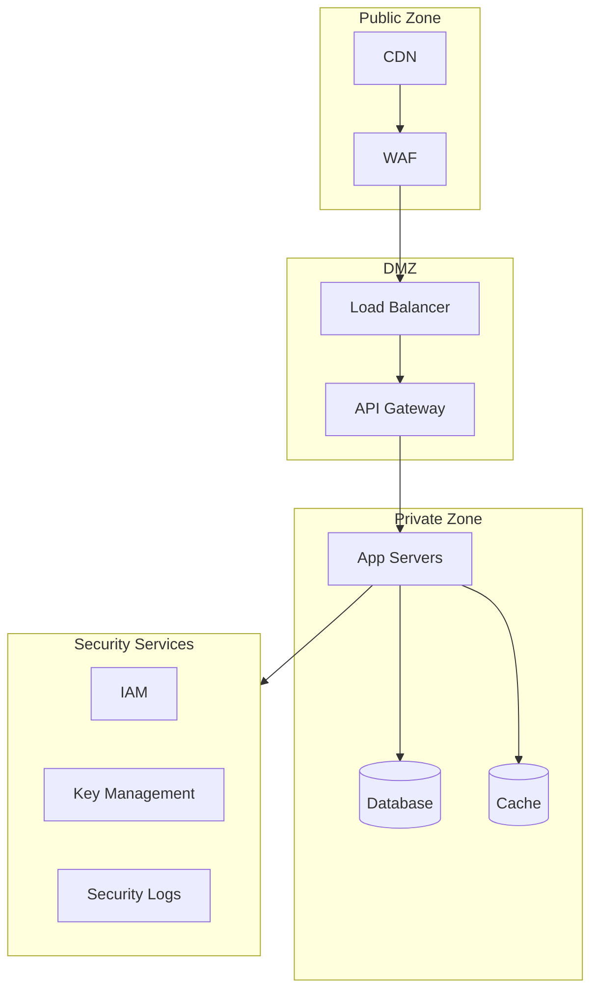

# Security Policy Template

Use this template for `04-governance/security-policy.md`.

---

```markdown
# Security Policy

> **Version:** 1.0.0
> **Status:** Draft | Review | Approved
> **Last Updated:** YYMMDD

---

## 1. Overview

This document defines security requirements, policies, and practices.

---

## 2. Security Architecture



---

## 3. Authentication

### 3.1 User Authentication

| Method | Use Case | Implementation |
|--------|----------|----------------|
| Email/Password | Primary login | bcrypt hash, min 12 chars |
| OAuth 2.0 | Social login | Google, GitHub, Microsoft |
| Magic Link | Passwordless | Email with signed token |
| MFA/2FA | High-security | TOTP (Google Authenticator) |

### 3.2 Token Strategy

| Token | Type | Lifetime | Storage |
|-------|------|----------|---------|
| Access Token | JWT | 15 minutes | Memory only |
| Refresh Token | Opaque | 7 days | httpOnly cookie |
| API Key | Opaque | Until revoked | Server-side |

### 3.3 Password Requirements

```
Minimum length:     12 characters
Complexity:         1 uppercase, 1 lowercase, 1 number
Common passwords:   Blocked (haveibeenpwned check)
Password history:   Last 5 passwords blocked
Expiration:         Optional (90 days for admin)
```

---

## 4. Authorization

### 4.1 RBAC Model

| Role | Description | Permissions |
|------|-------------|-------------|
| Super Admin | System owner | All permissions |
| Admin | Organization admin | Manage users, settings |
| Manager | Team lead | Manage team, view reports |
| Member | Regular user | CRUD own resources |
| Viewer | Read-only | View only |

### 4.2 Permission Matrix

| Resource | Create | Read | Update | Delete |
|----------|--------|------|--------|--------|
| Users | Admin+ | Member+ | Self/Admin+ | Admin+ |
| Projects | Manager+ | Member+ | Owner/Admin | Owner/Admin |
| Settings | Admin+ | Admin+ | Admin+ | Admin+ |

### 4.3 Resource-Level Authorization

```typescript
// Always verify ownership
if (resource.ownerId !== user.id && !user.isAdmin) {
  throw new ForbiddenError();
}
```

---

## 5. Data Protection

### 5.1 Encryption

| Layer | Algorithm | Key Size |
|-------|-----------|----------|
| In Transit | TLS 1.3 | 256-bit |
| At Rest (DB) | AES-256-GCM | 256-bit |
| At Rest (Files) | AES-256-GCM | 256-bit |
| Passwords | bcrypt | Cost factor 12 |
| PII Fields | AES-256-GCM | Per-field encryption |

### 5.2 Sensitive Data Handling

| Data Type | Storage | Logging | Display |
|-----------|---------|---------|---------|
| Passwords | Hashed only | Never | Masked |
| API Keys | Encrypted | Last 4 chars | Last 4 chars |
| Credit Cards | Tokenized (Stripe) | Never | Last 4 digits |
| SSN/ID Numbers | Encrypted | Never | Last 4 digits |
| Email | Plain | Masked | Full |

### 5.3 Data Retention

| Data Type | Retention | After Deletion |
|-----------|-----------|----------------|
| User data | Until account deletion | 30 days soft delete |
| Audit logs | 2 years | Archived |
| Session data | 30 days | Hard delete |
| Backups | 90 days | Rotated |

---

## 6. API Security

### 6.1 Rate Limiting

| Endpoint Type | Limit | Window |
|---------------|-------|--------|
| Public | 20 req | 1 minute |
| Authenticated | 100 req | 1 minute |
| Auth endpoints | 5 req | 1 minute |
| Admin | 200 req | 1 minute |

### 6.2 Input Validation

```typescript
// Always validate and sanitize
- Use parameterized queries (prevent SQL injection)
- Sanitize HTML output (prevent XSS)
- Validate file uploads (type, size, content)
- Validate URL parameters and query strings
- Use strict Content-Type checking
```

### 6.3 CORS Configuration

```typescript
cors({
  origin: ['https://app.example.com'],
  methods: ['GET', 'POST', 'PUT', 'DELETE'],
  credentials: true,
  maxAge: 86400,
});
```

### 6.4 Security Headers

```http
Strict-Transport-Security: max-age=31536000; includeSubDomains
Content-Security-Policy: default-src 'self'
X-Content-Type-Options: nosniff
X-Frame-Options: DENY
X-XSS-Protection: 1; mode=block
Referrer-Policy: strict-origin-when-cross-origin
```

---

## 7. Infrastructure Security

### 7.1 Network Security

- VPC with private subnets
- Security groups (least privilege)
- Network ACLs
- DDoS protection (CloudFlare/AWS Shield)

### 7.2 Server Hardening

- Minimal OS installation
- Regular patching (automated)
- Disabled unused ports/services
- SSH key-only access
- No root login

### 7.3 Container Security

- Base images from trusted sources
- Regular vulnerability scanning
- Non-root container execution
- Read-only file systems where possible
- Resource limits enforced

---

## 8. Monitoring & Audit

### 8.1 Security Logging

| Event | Log Level | Retention |
|-------|-----------|-----------|
| Login success | Info | 90 days |
| Login failure | Warning | 1 year |
| Permission denied | Warning | 1 year |
| Admin actions | Info | 2 years |
| Data export | Info | 2 years |
| API key usage | Info | 90 days |

### 8.2 Alerts

| Event | Threshold | Response |
|-------|-----------|----------|
| Failed logins | 5 in 5 min | Account lock |
| Rate limit hit | 3x limit | Temporary block |
| Suspicious IP | Blacklist match | Block + alert |
| Admin action | Any | Log + notify |

### 8.3 Audit Trail

```typescript
interface AuditLog {
  timestamp: Date;
  userId: string;
  action: string;
  resource: string;
  resourceId: string;
  ipAddress: string;
  userAgent: string;
  changes?: object;
  result: 'success' | 'failure';
}
```

---

## 9. Incident Response

### 9.1 Severity Levels

| Level | Description | Response Time |
|-------|-------------|---------------|
| P1 | Data breach, system down | 15 minutes |
| P2 | Security vulnerability | 1 hour |
| P3 | Suspicious activity | 4 hours |
| P4 | Policy violation | 24 hours |

### 9.2 Response Procedure

1. **Detect** — Identify and confirm incident
2. **Contain** — Isolate affected systems
3. **Investigate** — Determine scope and impact
4. **Remediate** — Fix vulnerability/issue
5. **Recover** — Restore normal operations
6. **Document** — Post-mortem and lessons learned

---

## 10. Compliance

### 10.1 Standards

| Standard | Status | Notes |
|----------|--------|-------|
| GDPR | Required | EU data subjects |
| SOC 2 | Planned | Type II |
| HIPAA | If applicable | Healthcare data |
| PCI DSS | Via Stripe | Payment data |

### 10.2 Data Subject Rights (GDPR)

- Right to access
- Right to rectification
- Right to erasure
- Right to portability
- Right to restriction
- Right to object

---

## 11. Open Questions

| # | Question | Impact | Status |
|---|----------|--------|--------|
| 1 | [Security decision] | [Impact] | Open |

---

## 12. Changelog

### YYMMDD - v1.0.0 - Initial Draft
- Defined authentication requirements
- Set authorization model
- Established data protection policies
```

---

## Validation Rules

- [ ] Version header present
- [ ] Security architecture diagram included
- [ ] Authentication methods defined
- [ ] Authorization model (RBAC) documented
- [ ] Data protection policies set
- [ ] Incident response procedures defined
