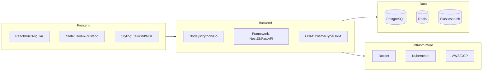

# Tech Stack Template

Use this template for `01-architecture/tech-stack.md`.

---

```markdown
# Tech Stack

> **Version:** 1.0.0
> **Status:** Draft | Review | Approved
> **Last Updated:** YYMMDD

---

## 1. Overview

This document defines all technology choices for the project with rationale.

---

## 2. Technology Stack Diagram (REQUIRED)



---

## 3. Frontend Stack

| Category | Technology | Version | Rationale |
|----------|------------|---------|-----------|
| Framework | [React/Vue/Next.js] | [version] | [Why chosen] |
| Language | TypeScript | [version] | Type safety |
| State | [Redux/Zustand/Jotai] | [version] | [Why chosen] |
| Styling | [Tailwind/MUI/Chakra] | [version] | [Why chosen] |
| Forms | [React Hook Form/Formik] | [version] | [Why chosen] |
| Data Fetching | [TanStack Query/SWR] | [version] | [Why chosen] |
| Routing | [React Router/TanStack Router] | [version] | [Why chosen] |
| Testing | [Vitest/Jest/Playwright] | [version] | [Why chosen] |

---

## 4. Backend Stack

| Category | Technology | Version | Rationale |
|----------|------------|---------|-----------|
| Runtime | [Node.js/Python/Go] | [version] | [Why chosen] |
| Framework | [NestJS/FastAPI/Gin] | [version] | [Why chosen] |
| Language | TypeScript/Python/Go | [version] | [Why chosen] |
| ORM | [Prisma/TypeORM/SQLAlchemy] | [version] | [Why chosen] |
| Validation | [class-validator/Zod/Pydantic] | [version] | [Why chosen] |
| Auth | [JWT/Passport/OAuth] | [version] | [Why chosen] |
| Queue | [BullMQ/Celery/RabbitMQ] | [version] | [Why chosen] |
| Testing | [Jest/pytest/go test] | [version] | [Why chosen] |

---

## 5. Data Layer

| Category | Technology | Version | Use Case |
|----------|------------|---------|----------|
| Primary DB | [PostgreSQL/MySQL] | [version] | Relational data |
| Cache | [Redis/Memcached] | [version] | Session, caching |
| Search | [Elasticsearch/Meilisearch] | [version] | Full-text search |
| File Storage | [S3/GCS/Cloudflare R2] | - | Media storage |
| Message Queue | [RabbitMQ/Kafka/SQS] | [version] | Async messaging |

---

## 6. Infrastructure

| Category | Technology | Version | Rationale |
|----------|------------|---------|-----------|
| Container | Docker | [version] | Containerization |
| Orchestration | [K8s/ECS/Cloud Run] | [version] | [Why chosen] |
| Cloud | [AWS/GCP/Azure] | - | [Why chosen] |
| CI/CD | [GitHub Actions/GitLab CI] | - | [Why chosen] |
| Monitoring | [Datadog/Grafana/New Relic] | - | [Why chosen] |
| Logging | [ELK/CloudWatch/Loki] | - | [Why chosen] |

---

## 7. Development Tools

| Category | Tool | Purpose |
|----------|------|---------|
| Package Manager | [pnpm/npm/yarn] | Dependency management |
| Linting | ESLint + Prettier | Code quality |
| Git Hooks | Husky + lint-staged | Pre-commit checks |
| API Docs | [Swagger/OpenAPI] | API documentation |
| Local Dev | Docker Compose | Local environment |

---

## 8. Third-Party Services

| Service | Purpose | Fallback |
|---------|---------|----------|
| [Auth0/Clerk] | Authentication | [Backup option] |
| [Stripe/SePay] | Payments | [Backup option] |
| [SendGrid/Resend] | Email | [Backup option] |
| [Twilio/MessageBird] | SMS | [Backup option] |
| [OpenAI/Anthropic] | AI/LLM | [Backup option] |

---

## 9. Version Compatibility Matrix

| Component | Min Version | Recommended | Max Version |
|-----------|-------------|-------------|-------------|
| Node.js | 18.x | 20.x | 22.x |
| PostgreSQL | 14 | 16 | 16 |
| Docker | 24.x | 25.x | - |

---

## 10. Open Questions

| # | Question | Impact | Status |
|---|----------|--------|--------|
| 1 | [Technology decision pending] | [Impact] | Open |

---

## 11. Changelog

### YYMMDD - v1.0.0 - Initial Draft
- Defined technology stack
- Added rationale for each choice
```

---

## Validation Rules

- [ ] Version header present
- [ ] Stack diagram (mermaid) included
- [ ] All technologies have version numbers
- [ ] All choices have rationale documented
- [ ] Third-party services listed with fallbacks
- [ ] Compatibility matrix defined
