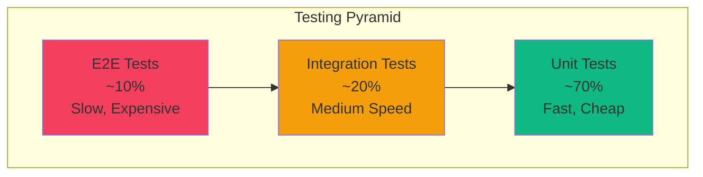

# Testing Strategy Template

Use this template for `02-standards/testing-strategy.md`.

---

```markdown
# Testing Strategy

> **Version:** 1.0.0
> **Status:** Draft | Review | Approved
> **Last Updated:** YYMMDD

---

## 1. Overview

This document defines the testing strategy, coverage requirements, and tooling.

---

## 2. Testing Pyramid



---

## 3. Test Types

### 3.1 Unit Tests

**Purpose:** Test individual functions, classes, components in isolation.

**Coverage Target:** 80%+ line coverage

**Tools:**
- Backend: [Jest/Vitest/pytest]
- Frontend: [Vitest/Jest/React Testing Library]

**Scope:**
- Pure functions
- Business logic
- Utility functions
- Component rendering

**Example:**
```typescript
describe('calculateTotal', () => {
  it('should sum items correctly', () => {
    const items = [{ price: 10 }, { price: 20 }];
    expect(calculateTotal(items)).toBe(30);
  });

  it('should return 0 for empty array', () => {
    expect(calculateTotal([])).toBe(0);
  });
});
```

---

### 3.2 Integration Tests

**Purpose:** Test module interactions, API endpoints, database operations.

**Coverage Target:** Critical paths covered

**Tools:**
- Backend: [Supertest/httpx]
- Database: [Test containers/in-memory DB]

**Scope:**
- API endpoints
- Database queries
- Service interactions
- External service mocks

**Example:**
```typescript
describe('POST /users', () => {
  it('should create user and return 201', async () => {
    const response = await request(app)
      .post('/users')
      .send({ email: 'test@example.com', password: 'secure123' });

    expect(response.status).toBe(201);
    expect(response.body.data.email).toBe('test@example.com');
  });
});
```

---

### 3.3 End-to-End Tests

**Purpose:** Test complete user flows through the application.

**Coverage Target:** Critical user journeys

**Tools:**
- [Playwright/Cypress]

**Scope:**
- User registration flow
- Login flow
- Core business flows
- Payment flows

**Example:**
```typescript
test('user can complete checkout', async ({ page }) => {
  await page.goto('/products');
  await page.click('[data-testid="add-to-cart"]');
  await page.click('[data-testid="checkout"]');
  await page.fill('#email', 'test@example.com');
  await page.click('[data-testid="place-order"]');
  await expect(page.locator('.order-confirmation')).toBeVisible();
});
```

---

## 4. Coverage Requirements

| Test Type | Minimum | Target | Critical |
|-----------|---------|--------|----------|
| Unit Tests | 70% | 80% | 90% |
| Integration | - | Key paths | 100% |
| E2E | - | User journeys | 100% |

### Coverage Enforcement

```yaml
# In CI pipeline
coverage:
  lines: 70
  branches: 60
  functions: 70
  statements: 70
```

---

## 5. Test Organization

### Directory Structure

```
tests/
├── unit/
│   ├── services/
│   └── utils/
├── integration/
│   ├── api/
│   └── database/
├── e2e/
│   ├── auth.spec.ts
│   └── checkout.spec.ts
└── fixtures/
    ├── users.json
    └── products.json
```

### Naming Conventions

| Type | Pattern | Example |
|------|---------|---------|
| Unit | `*.test.ts` | `user.service.test.ts` |
| Integration | `*.spec.ts` | `users.api.spec.ts` |
| E2E | `*.e2e-spec.ts` | `checkout.e2e-spec.ts` |

---

## 6. Test Data

### Fixtures

```typescript
// fixtures/users.ts
export const validUser = {
  email: 'test@example.com',
  password: 'SecurePass123!',
};

export const adminUser = {
  ...validUser,
  role: 'admin',
};
```

### Factories

```typescript
// factories/user.factory.ts
export function createUser(overrides = {}) {
  return {
    id: faker.string.uuid(),
    email: faker.internet.email(),
    createdAt: new Date(),
    ...overrides,
  };
}
```

### Database Seeding

```typescript
beforeEach(async () => {
  await prisma.user.deleteMany();
  await prisma.user.createMany({ data: testUsers });
});

afterAll(async () => {
  await prisma.$disconnect();
});
```

---

## 7. Mocking Strategy

### External Services

```typescript
// Mock Stripe
jest.mock('@/lib/stripe', () => ({
  createPaymentIntent: jest.fn().mockResolvedValue({
    id: 'pi_test',
    status: 'succeeded',
  }),
}));
```

### Database (Integration)

```typescript
// Use test database
beforeAll(async () => {
  await setupTestDatabase();
});

afterAll(async () => {
  await teardownTestDatabase();
});
```

### When to Mock

| Mock | Don't Mock |
|------|------------|
| External APIs | Internal services (integration) |
| Payment gateways | Database (integration) |
| Email services | Business logic |
| Time-sensitive operations | Pure functions |

---

## 8. CI/CD Integration

### Pipeline Stages

```yaml
test:
  stages:
    - lint
    - unit-tests
    - integration-tests
    - e2e-tests

  unit-tests:
    script: npm run test:unit
    coverage: true

  integration-tests:
    script: npm run test:integration
    services:
      - postgres:15
      - redis:7

  e2e-tests:
    script: npm run test:e2e
    environment: staging
```

### Test Reports

- JUnit XML for CI integration
- HTML coverage reports
- Slack notifications for failures

---

## 9. Performance Testing

### Load Testing

**Tools:** [k6/Artillery/JMeter]

**Targets:**
| Endpoint | Users | Response Time | Error Rate |
|----------|-------|---------------|------------|
| GET /products | 100 | < 200ms | < 1% |
| POST /orders | 50 | < 500ms | < 0.1% |

### Stress Testing

Run before major releases to identify breaking points.

---

## 10. Security Testing

### SAST (Static Analysis)

- Tool: [SonarQube/Snyk]
- Run: Every PR

### DAST (Dynamic Analysis)

- Tool: [OWASP ZAP]
- Run: Weekly

### Dependency Scanning

- Tool: [Dependabot/Snyk]
- Run: Daily

---

## 11. Open Questions

| # | Question | Impact | Status |
|---|----------|--------|--------|
| 1 | [Testing tool decision] | [Impact] | Open |

---

## 12. Changelog

### YYMMDD - v1.0.0 - Initial Draft
- Defined testing pyramid
- Set coverage requirements
- Established test organization
```

---

## Validation Rules

- [ ] Version header present
- [ ] Testing pyramid diagram included
- [ ] Coverage requirements defined
- [ ] Test organization documented
- [ ] CI/CD integration defined
