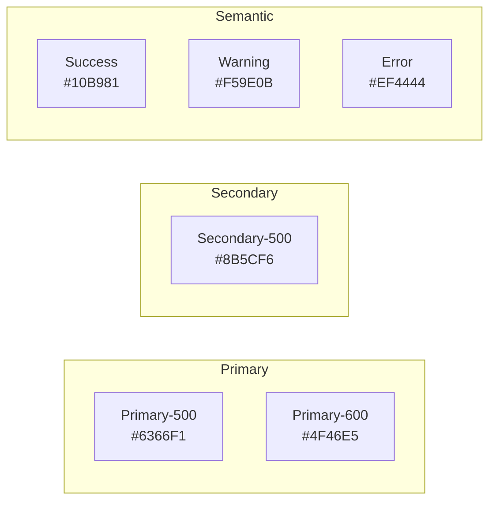

# UI/UX Design System Template

Use this template for `03-design/ui-ux-design-system.md`.

---

```markdown
# UI/UX Design System

> **Version:** 1.0.0
> **Status:** Draft | Review | Approved
> **Last Updated:** YYMMDD

---

## 1. Overview

This document defines the visual design system and UX guidelines.

---

## 2. Design Principles

| Principle | Description |
|-----------|-------------|
| **Clarity** | Clear hierarchy, obvious actions |
| **Consistency** | Same patterns everywhere |
| **Efficiency** | Minimize clicks, maximize productivity |
| **Accessibility** | WCAG 2.1 AA compliance |
| **Responsiveness** | Mobile-first, works everywhere |

---

## 3. Color Palette

### Primary Colors



### Color Usage Table

| Role | Color | Hex | Tailwind | Usage |
|------|-------|-----|----------|-------|
| Primary | Indigo | #6366F1 | `indigo-500` | CTAs, links, focus |
| Primary Hover | Indigo | #4F46E5 | `indigo-600` | Hover states |
| Secondary | Violet | #8B5CF6 | `violet-500` | Secondary actions |
| Success | Emerald | #10B981 | `emerald-500` | Success states, positive |
| Warning | Amber | #F59E0B | `amber-500` | Warnings, caution |
| Error | Red | #EF4444 | `red-500` | Errors, destructive |
| Background | Slate | #F8FAFC | `slate-50` | Page background |
| Surface | White | #FFFFFF | `white` | Cards, modals |
| Text | Slate | #1E293B | `slate-800` | Primary text |
| Text Muted | Slate | #64748B | `slate-500` | Secondary text |
| Border | Slate | #E2E8F0 | `slate-200` | Borders, dividers |

### Dark Mode

| Light | Dark |
|-------|------|
| `slate-50` bg | `slate-900` bg |
| `white` surface | `slate-800` surface |
| `slate-800` text | `slate-100` text |

---

## 4. Typography

### Font Stack

```css
--font-sans: 'Inter', -apple-system, BlinkMacSystemFont, 'Segoe UI', sans-serif;
--font-mono: 'JetBrains Mono', 'Fira Code', monospace;
```

### Type Scale

| Level | Size | Line Height | Weight | Usage |
|-------|------|-------------|--------|-------|
| Display | 48px | 56px | 700 | Hero headlines |
| H1 | 32px | 40px | 600 | Page titles |
| H2 | 24px | 32px | 600 | Section headers |
| H3 | 20px | 28px | 500 | Card headers |
| H4 | 16px | 24px | 500 | Subsections |
| Body | 16px | 24px | 400 | Paragraphs |
| Body Small | 14px | 20px | 400 | Secondary text |
| Caption | 12px | 16px | 400 | Labels, metadata |

### Font Weights

```
Light:     300
Regular:   400
Medium:    500
Semibold:  600
Bold:      700
```

---

## 5. Spacing

### Spacing Scale

| Token | Value | Usage |
|-------|-------|-------|
| xs | 4px | Icon padding |
| sm | 8px | Tight spacing |
| md | 16px | Default spacing |
| lg | 24px | Section spacing |
| xl | 32px | Large gaps |
| 2xl | 48px | Page sections |
| 3xl | 64px | Hero sections |

### Layout Grid

```
Columns:     12
Gutter:      24px
Margin:      16px (mobile), 32px (tablet), 64px (desktop)
Max Width:   1280px
```

---

## 6. Layout Structure

### Application Shell

```
┌─────────────────────────────────────────────────────────────┐
│                    HEADER (64px, sticky)                     │
├──────────┬─────────────────────────────────────────────────┤
│          │                                                  │
│ SIDEBAR  │              MAIN CONTENT                        │
│ (256px)  │              (padding: 24px)                     │
│          │                                                  │
│ - Logo   │  ┌──────────────────────────────────────────┐   │
│ - Nav    │  │  Page Header                             │   │
│ - Quick  │  ├──────────────────────────────────────────┤   │
│   Action │  │                                          │   │
│ - User   │  │  Content Area                            │   │
│          │  │                                          │   │
│          │  │  (Cards, Tables, Forms)                  │   │
│          │  │                                          │   │
│          │  └──────────────────────────────────────────┘   │
│          │                                                  │
└──────────┴─────────────────────────────────────────────────┘
```

### Responsive Breakpoints

| Breakpoint | Width | Sidebar |
|------------|-------|---------|
| Mobile | < 768px | Drawer (hidden) |
| Tablet | 768-1023px | Collapsed (icons) |
| Desktop | ≥ 1024px | Full (256px) |

---

## 7. Components

### Buttons

| Variant | Classes | Usage |
|---------|---------|-------|
| Primary | `bg-indigo-500 text-white hover:bg-indigo-600` | Main actions |
| Secondary | `bg-slate-100 text-slate-700 hover:bg-slate-200` | Secondary |
| Outline | `border border-slate-300 hover:bg-slate-50` | Tertiary |
| Ghost | `hover:bg-slate-100` | Minimal |
| Destructive | `bg-red-500 text-white hover:bg-red-600` | Dangerous |

### Button Sizes

| Size | Padding | Font |
|------|---------|------|
| sm | `px-3 py-1.5` | 14px |
| md | `px-4 py-2` | 14px |
| lg | `px-6 py-3` | 16px |

### Cards

```css
.card {
  @apply bg-white rounded-xl border border-slate-200 shadow-sm;
  @apply p-6;
}

.card-header {
  @apply text-lg font-semibold text-slate-800 mb-4;
}
```

### Form Inputs

```css
.input {
  @apply w-full px-4 py-2.5;
  @apply border border-slate-300 rounded-lg;
  @apply focus:ring-2 focus:ring-indigo-500 focus:border-indigo-500;
  @apply placeholder:text-slate-400;
}

.input-error {
  @apply border-red-500 focus:ring-red-500;
}

.label {
  @apply block text-sm font-medium text-slate-700 mb-1.5;
}
```

### Badges

| Variant | Classes |
|---------|---------|
| Default | `bg-slate-100 text-slate-700` |
| Success | `bg-emerald-100 text-emerald-700` |
| Warning | `bg-amber-100 text-amber-700` |
| Error | `bg-red-100 text-red-700` |
| Info | `bg-blue-100 text-blue-700` |

---

## 8. Icons

**Library:** [Lucide Icons / Heroicons / Phosphor]

### Sizes

| Size | Pixels | Usage |
|------|--------|-------|
| sm | 16px | Inline with text |
| md | 20px | Buttons, default |
| lg | 24px | Headers, emphasis |
| xl | 32px | Empty states |

### Usage

```tsx
import { ChevronRight, Check, X } from 'lucide-react';

<ChevronRight className="w-5 h-5 text-slate-400" />
```

---

## 9. Feedback States

### Loading

- **Skeleton:** Initial page/component load
- **Spinner:** Button actions, inline loading
- **Progress:** File uploads, multi-step

### Empty States

```
┌────────────────────────────────────┐
│                                    │
│         [Illustration]             │
│                                    │
│     No items found                 │
│     Add your first item            │
│                                    │
│        [Primary CTA]               │
│                                    │
└────────────────────────────────────┘
```

### Error States

- Inline: Red text below input
- Toast: Top-right notification
- Full page: Error illustration + retry

### Success States

- Toast: Green notification
- Inline: Green checkmark
- Modal: Success confirmation

---

## 10. Accessibility (WCAG 2.1 AA)

### Requirements

| Requirement | Standard | Implementation |
|-------------|----------|----------------|
| Color Contrast | 4.5:1 text, 3:1 UI | Test with axe |
| Focus Visible | Must be visible | `ring-2 ring-indigo-500` |
| Keyboard | Full keyboard nav | Tab order, shortcuts |
| Screen Reader | aria-* attributes | Labels, live regions |
| Motion | Reduce motion option | `prefers-reduced-motion` |

### Focus Styles

```css
*:focus-visible {
  @apply outline-none ring-2 ring-indigo-500 ring-offset-2;
}
```

---

## 11. Animation

### Transitions

```css
/* Default transition */
transition: all 150ms ease-in-out;

/* Hover states */
transition: background-color 150ms, color 150ms;

/* Modal/Drawer */
transition: transform 200ms ease-out, opacity 200ms;
```

### Motion Principles

- Subtle, purposeful animations
- < 300ms for micro-interactions
- Respect `prefers-reduced-motion`

---

## 12. Open Questions

| # | Question | Impact | Status |
|---|----------|--------|--------|
| 1 | Dark mode priority? | UX | Open |
| 2 | Custom illustrations? | Brand | Open |

---

## 13. Changelog

### YYMMDD - v1.0.0 - Initial Draft
- Defined color palette
- Set typography scale
- Documented component patterns
```

---

## Validation Rules

- [ ] Version header present
- [ ] Color palette documented with hex values
- [ ] Typography scale defined
- [ ] Spacing system documented
- [ ] Component patterns defined
- [ ] Accessibility requirements listed
