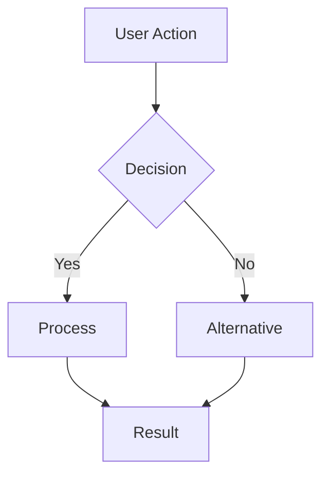
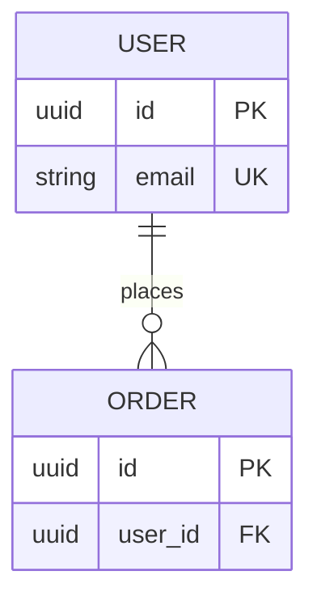
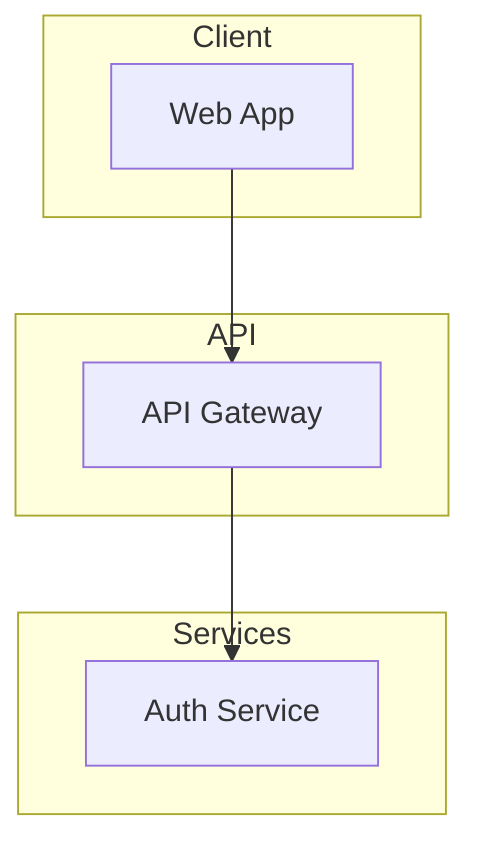
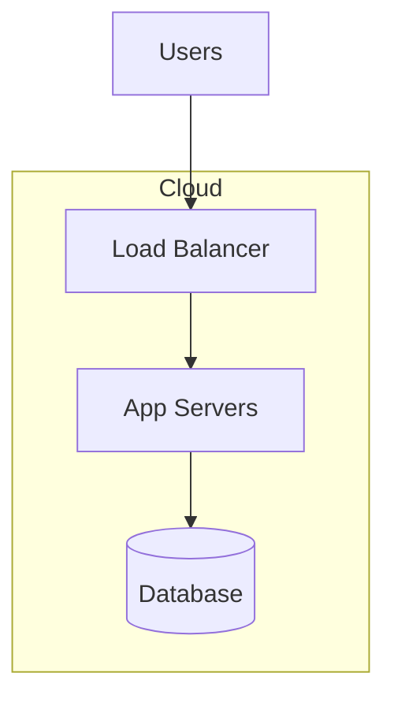

# Spec Governance

Ensure all specifications follow ASDF standards, include required diagrams, and are properly versioned.

## When to Use

- Creating new feature specs (`/asdf:spec`)
- Creating domain specs (`/asdf:init`)
- Creating system-core docs (`/asdf:init`)
- Validating existing specs
- Reviewing spec quality

## Templates

### Feature Spec Template
Load: `references/feature-template.md`

### Domain Spec Template
Load: `references/domain-template.md`

### System-Core Templates
Load: `references/system-core-templates/README.md`

Individual templates:
- `references/system-core-templates/master-map-template.md`
- `references/system-core-templates/data-architecture-template.md`
- `references/system-core-templates/infrastructure-template.md`

## Validation Rules
Load: `references/validation-rules.md`

---

## Mandatory Requirements

### 1. Version Header (ALL specs)

Every spec file MUST start with:
```markdown
> **Version:** 1.0.0
> **Status:** Draft | Review | Approved
> **Last Updated:** YYMMDD
```

### 2. Mermaid Diagrams (REQUIRED)

| Document Type | Required Diagram | Mermaid Type |
|---------------|------------------|--------------|
| master-map.md | System architecture | flowchart |
| data-architecture.md | ERD | erDiagram |
| infrastructure.md | Deployment topology | flowchart |
| Domain specs | Entity relationships | erDiagram |
| Feature specs | User flow | flowchart |

**Never create these documents without their required diagrams.**

### 3. Open Questions Section

All specs MUST include:
```markdown
## Open Questions

| # | Question | Impact | Status |
|---|----------|--------|--------|
| 1 | [Unresolved item] | [How it affects work] | Open |
```

### 4. Changelog Section

All specs MUST include:
```markdown
## Changelog

### YYMMDD - v1.0.0 - Initial Draft
- Created spec
- [What was defined]
```

---

## Quick Reference

### Feature Spec Required Sections
1. Overview + Business Value
2. **User Flow Diagram (mermaid)** ← REQUIRED
3. Requirements (FR/NFR/Out of Scope)
4. Technical Design + Data Flow Diagram
5. UI/UX (wireframes)
6. API Contract
7. Acceptance Criteria
8. Testing
9. **Open Questions** ← REQUIRED
10. Implementation Progress
11. **Changelog** ← REQUIRED

### Domain Spec Required Sections
1. Overview + Responsibilities
2. **ERD Diagram (mermaid)** ← REQUIRED
3. Entities (with field types)
4. State Machines (if applicable)
5. Domain Events
6. API Contracts
7. Business Rules
8. Error Codes
9. Dependencies
10. **Open Questions** ← REQUIRED
11. **Changelog** ← REQUIRED

### System-Core Required Diagrams
| File | Diagram |
|------|---------|
| master-map.md | System architecture flowchart |
| data-architecture.md | Full ERD |
| infrastructure.md | Deployment topology |

---

## Naming Conventions

| Type | Convention | Example |
|------|------------|---------|
| Feature folders | YYMMDD-feature-name | 251224-user-auth |
| Domain folders | domain-name | auth, payments |
| Requirement IDs | FR-001, NFR-001 | FR-001 |
| Acceptance Criteria | AC-001 | AC-001 |
| Business Rule IDs | [DOMAIN]-001 | AUTH-001 |
| Version | Semantic | 1.0.0, 1.1.0, 2.0.0 |

---

## Quality Checklist

Before finalizing any spec:

### Universal (All Specs)
- [ ] Version header present (v1.0.0 format)
- [ ] Status field present (Draft/Review/Approved)
- [ ] Last Updated date set
- [ ] Open Questions section present
- [ ] Changelog section present

### Feature Specs
- [ ] User flow mermaid diagram included
- [ ] All FRs have priority
- [ ] All NFRs have measurable targets
- [ ] API contracts have request/response examples
- [ ] Acceptance criteria are testable (Given/When/Then)

### Domain Specs
- [ ] ERD mermaid diagram included
- [ ] All entities documented with field types
- [ ] Business rules have unique IDs
- [ ] Dependencies mapped (incoming and outgoing)

### System-Core Docs
- [ ] Required diagram included (master-map, data-architecture, infrastructure)
- [ ] Deep technical content (not placeholders)
- [ ] Rules & constraints documented

---

## Diagram Examples

### User Flow (Feature Specs)


### ERD (Domain Specs)


### System Architecture (master-map.md)


### Deployment Topology (infrastructure.md)

